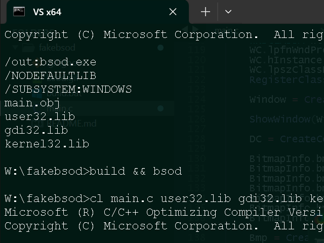

# FakeBSOD

It's a fake Windows Xp/Vista/7 BSOD. *Completely harmless*, can be exited with
ALT+F4 =D

You can provide custom text by placing `bsod.txt` alongside the current directory.

Get the latest release https://github.com/skejeton/FakeBSOD/releases

# Building

Run `build.bat` under VS dev environment.